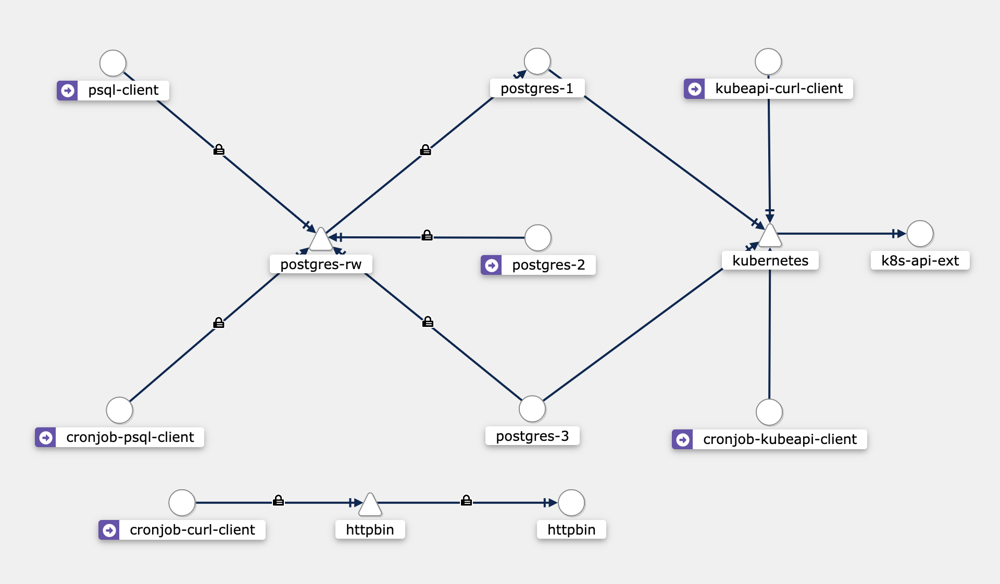

# istio-ambient

Repository for reproducing issues with Istio Ambient mode (primarily on EKS but also on KIND)

Issues Successfully reproduced:

- `psql` isn't happy connecting in cronjobs first time (and this means migration tools in pre-upgrade helm hooks spawning jobs aren't behaving since they don't retry inside the pod, merely reschedule the job).
- `curl` often takes 2-5 attempted to get a successful 200 back from both a httpbin deployment, and a request to the kube API on the control plane.
- Intermittently getting `Failed to create pod sandbox: rpc error: code = Unknown desc = failed to setup network for sandbox "1eaf61990b0c01af004695c9b42baba76c39f8fb700e3b3a18c7172ffb89f8c2": plugin type="istio-cni" name="istio-cni" failed (add): unable to push CNI event, error was 500` errors - primarily on EKS, and primarily if I cycle the nodes in the node group abruptly. New nodes then can suffer this issue but it's not always happening.
- Ztunnel is chatty with logs akin to and come in bursts from the cronjobs doing their initial failure to connect/retry loop:

    ``` none
    2024-06-24T13:17:35.836354Z    warn    proxy::h2_client    HBONE ping timeout/error                                                                                                                                                                                                                                                                                                   │
    2024-06-24T13:18:01.433003Z    warn    access    connection failed    src.addr=192.168.176.17:34324 dst.addr=10.100.82.126:5432 direction="outbound" error=unknown source: 192.168.176.17  
    ```

Issues not successfully reproduced:

- The [issue comment](https://github.com/istio/istio/issues/51622#issuecomment-2185148236) here - Can't reproduce this easily on a fresh EKS cluster but attempting to find out what triggers it.

## Quickstart



There's 3 targets, 3 cronjobs and 2 deployments.

1. Kubernetes API
   - Targetted by a cronjob running curl until success.
   - Targetted by a deployment running curl every 1s (ish).
1. Postgres Cluster provisioned by Cloudnative-PG
   - Targetted by a cronjob running psql until success.
   - Targetted by a deployment running psql every 1s (ish).
1. HTTPbin echo service
   - Targetted by a cronjob running curl until success.

### Kind

To create:

> [!NOTE]
> Install istioctl alpha prior to running other commands:
>
> ``` shell
> TAG=$(curl https://storage.googleapis.com/istio-build/dev/latest)
> # on Linux
> wget https://storage.googleapis.com/istio-build/dev/$TAG/istioctl-$TAG-linux-amd64.tar.gz
> tar -xvf istioctl-$TAG-linux-amd64.tar.gz
> # on macOS
> wget https://storage.googleapis.com/istio-build/dev/$TAG/istioctl-$TAG-osx.tar.gz
> tar -xvf istioctl-$TAG-osx.tar.gz
> # on Windows
> wget https://storage.googleapis.com/istio-build/dev/$TAG/istioctl-$TAG-win.zip
> unzip istioctl-$TAG-win.zip
> ```

``` shell
kind create cluster --config kind.yaml # check kubectl context is set correctly before the following commands
kubectl kustomize "github.com/kubernetes-sigs/gateway-api/config/crd/experimental?ref=v1.1.0" | kubectl apply -f -
./istioctl install --set profile=ambient --set tag=$TAG --skip-confirmation
kubectl label namespace default istio.io/dataplane-mode=ambient
kubectl apply -f https://raw.githubusercontent.com/istio/istio/release-1.22/samples/addons/prometheus.yaml --wait
kubectl apply -f https://raw.githubusercontent.com/istio/istio/release-1.22/samples/addons/kiali.yaml --wait
kubectl apply --server-side -f https://raw.githubusercontent.com/cloudnative-pg/cloudnative-pg/release-1.23/releases/cnpg-1.23.2.yaml --wait
kubectl apply -k manifests/ --wait
```

To destroy:

``` shell
kind delete cluster --config kind.yaml
```

### EKS

To create:

``` shell
eksctl create cluster -f eksctl.yaml # check kubectl context is set correctly before the following commands
kubectl kustomize "github.com/kubernetes-sigs/gateway-api/config/crd/experimental?ref=v1.1.0" | kubectl apply -f -
istioctl install --set profile=ambient --skip-confirmation
kubectl label namespace default istio.io/dataplane-mode=ambient
kubectl apply -f https://raw.githubusercontent.com/istio/istio/release-1.22/samples/addons/prometheus.yaml --wait
kubectl apply -f https://raw.githubusercontent.com/istio/istio/release-1.22/samples/addons/kiali.yaml --wait
kubectl apply --server-side -f https://raw.githubusercontent.com/cloudnative-pg/cloudnative-pg/release-1.23/releases/cnpg-1.23.2.yaml --wait
kubectl apply -k manifests/ --wait
```

To destroy:

``` shell
eksctl delete cluster -f eksctl.yaml --disable-nodegroup-eviction
```
